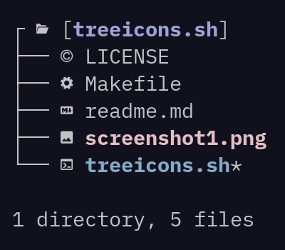

# treeicons.sh

A tree with icons



<p align="center">
<a href="https://github.com/eylles/treeicons.sh" alt="GitHub"></a>
<a href="https://gitlab.com/eylles/treeicons.sh" alt="GitLab"></a>
<a href="https://codeberg.org/eylles/treeicons.sh" alt="CodeBerg"></a>
</p>

## why ?

I wanted to have tree with icons.


## usage

Just run make to install or uninstall, all this depends on is a shell interpreter and  tree.

View the available options with:

```sh
treeicons -h
```

To use inside vifm add this to your vifmrc:

```
" Directories
fileviewer */ treeicons -l %ph %f
fileviewer .*/ treeicons -l %ph %f
```
